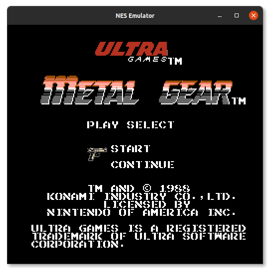
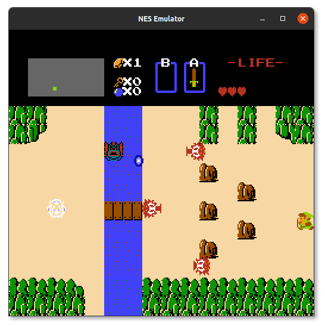
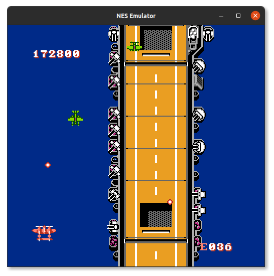

# An NES emulator written in pure C

Here lies an NES emulator I wrote to learn about emulation and generally
sharpen my understanding of the C language. Don't let this fool you though.
It is a pretty decent emulator with full 6502 instruction set (official, 
unofficial and most illegal opcodes) to say the least.

## What is implemented

Below shows the features that have been implemented. This is obviously
subject to change as I will continue to implement features where I can 
over time. Any help is welcome.

* CPU (6502)
    - [x] Official opcodes
    - [x] Unofficial opcodes
    - [x] Cycle accuracy (official & unofficial)
    - [ ] BCD arithmetic (Not needed by NES anyway)
* Memory
    - [x] Extended RAM
    - [ ] Expansion ROM
    - [ ] Battery backed (persistent) save RAM
    - [ ] Open-bus behaviour
* PPU (Picture Processing Unit)
    - [x] NTSC
    - [x] PAL
    - [ ] Dendy
* APU (Audio Processing Unit)
    - [x] Pulse channel
    - [x] Triangle channel
    - [x] Noise channel
    - [ ] Delta Modulation Channel
* Gaming input
    - [x] Keyboard input
    - [ ] Keyboard (multiplayer)
    - [ ] Original NES controller
    - [x] Gamepad controller (Multiplayer)
    - [x] Turbo keys
* Mappers
    - [x] \#0   NROM
    - [x] \#1   MMC1
    - [x] \#2   UxROM
    - [x] \#3   CNROM
    - [ ] \#4   MMC3
    - [ ] \#5   MMC5
    - [x] \#7   AxROM
    - [x] \#66  GNROM
* Game genie (for cheat codes)
    
## What can be played

I haven't really taken time to do a survey but based on mappers implemented 
we can put the estimate at 51.7% of NES games. This is assuming none of them are 
using a quirk that I haven't gotten round to implementing. Games using 
mid-scanline trickery may not work as expected unless I find time to iron
out timing issues in the PPU. Below are a few demos:

_Contra_


_Metal gear_



_Legend of Zelda_



_1943: Battle of Midway_



## Controller setup
Xbox and Playstation controllers have not been tested on the emulator and are not guaranteed to work
as shown here.

| **Key** | **Keyboard** | **Playstation**   | **Xbox**          |
|---------|--------------|-------------------|-------------------|
 | Start   | Enter        | Start             | Menu              |
 | Select  | Shift        | Select            | View              |
 | A       | J            | ▢                 | X                 |
 | B       | K            | ◯                 | B                 |
 | Turbo A | H            | △                 | Y                 |
 | Turbo B | B            | X                 | A                 |
 | up      | Up           | D-pad/stick Up    | D-pad/stick Up    |
 | down    | Down         | D-pad/stick Down  | D-pad/stick Down  |
 | left    | Left         | D-pad/stick Left  | D-pad/stick Left  |
 | right   | Right        | D-pad/stick Right | D-pad/stick Right |

## Compiling

Compiling the emulator requires:
* a C11 (or higher) compiler e.g. gcc  
* SDL2 library for graphics
* cmake
* make (linux)

Assuming have the above requirements installed on your system,
Acquire and build the source as follows:

```shell
$ git clone https://github.com/obaraemmanuel/NES
$ cd NES
$ mkdir build && cd build
$ cmake ..
$ make
```

You can now run the built emulator

```shell
$ ./nes ~/nes/roms/Contra.nes
```

To run with *Game Genie* enabled provide path to the original game genie ROM as an extra argument
```shell
$ ./nes ~/nes/roms/Contra.nes ~/nes/roms/game_genie.nes
```